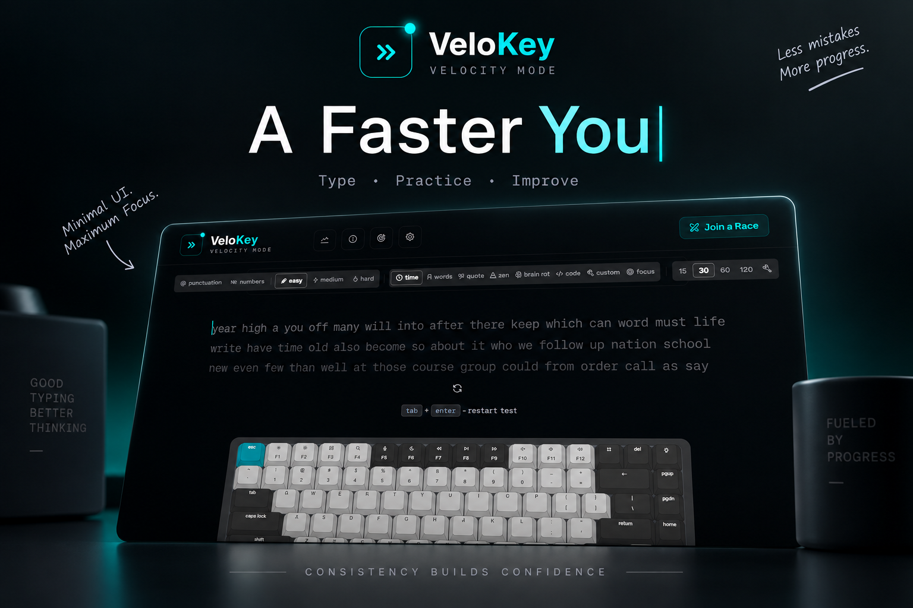

<p align="center">
  
</p>

<h1 align="center">VeloKey</h1>

<p align="center">
  <strong>A minimal, distraction-free typing test — practice solo or race friends in real time.</strong>
</p>

<p align="center">
  <a href="https://velokey.app"><strong>velokey.app</strong></a>&nbsp;&nbsp;·&nbsp;&nbsp;<a href="#getting-started">Getting Started</a>&nbsp;&nbsp;·&nbsp;&nbsp;<a href="#features">Features</a>&nbsp;&nbsp;·&nbsp;&nbsp;<a href="#architecture">Architecture</a>&nbsp;&nbsp;·&nbsp;&nbsp;<a href="#contributing">Contributing</a>
</p>

<p align="center">
  <a href="https://velokey.app"></a>
  <a href="https://github.com/rishabhx29/velokey/actions/workflows/ci.yml"></a>
  <a href="LICENSE"></a>
  
</p>

---

## About

**VeloKey** is an open-source, browser-based typing test built for speed, accuracy, and flow. Practice with timed drills, word counts, quotes, and code snippets — then take it up a notch with **live multiplayer races** over WebSockets. Real-time WPM tracking, responsive virtual keyboards, mechanical switch sound packs, and a curated theme gallery round out the experience.

## Features

### Solo Practice

| Mode           | What you get                                                              |
| -------------- | ------------------------------------------------------------------------- |
| **Time**       | 15s / 30s / 60s / 120s sprints (or a custom duration)                     |
| **Words**      | Fixed word-count drills (10 / 25 / 50 / 100, or custom)                   |
| **Quotes**     | Curated quotes with short / medium / long / XL presets                    |
| **Code**       | Real code snippets with syntax-aware highlighting                         |
| **Zen**        | Endless free typing — no timer, no score, just flow                       |
| **Difficulty** | Easy, Medium, and Hard word tiers across **38 languages** (RTL supported) |

### Multiplayer Races

- **Create or join rooms** with shareable `VELO-XXXX` codes **and QR-code invites**
- **Quick Match** — batched matchmaking fills rooms of up to 8 players
- **Live opponent carets** rendered directly in the race text, plus a real-time progress strip
- **Race audio** — countdown beeps, a "go" tone, overtake whooshes, and a finish horn
- **Ready-check auto-start** — the countdown fires once everyone is ready
- **Fair play** — server-side anti-cheat validation rejects spoofed stats
- **Resilient rooms** — 10s disconnect grace with rejoin, host migration, rematch support

### Keyboards & Feedback

- **5 keyboard skins** — Classic, Mechanical, Minimal, RGB, and Magic — with live key highlighting as you type
- **Mechanical switch sound packs** (Web Audio) and **haptics** on supported devices
- Toggleable from Settings; everything respects the global sound preference

### Customization

- **17 curated themes** (Gruvbox, Catppuccin, Cyberpunk, Vercel, Supabase, and more) plus a **Theme Studio** for your own
- Accent colors, Google Fonts typography, realtime WPM display
- All settings persist in `localStorage` — no account required

### Results & Stats

- WPM, raw speed, accuracy, consistency, and a full character breakdown
- WPM-over-time charts (Recharts)
- Local test history with personal bests on the `/stats` page

## Architecture

VeloKey is two independently deployed services sharing one protocol:

```
┌──────────────────────┐         WebSocket          ┌───────────────────────────┐
│  Next.js web app     │◄──────────────────────────►│  PartyKit race server      │
│  app/ components/    │   join · progress · finish │  realtime/race-room.ts    │
│  hooks/ lib/         │                            │  (Durable Object per room) │
└──────────────────────┘                            └───────────────────────────┘
           ▲                                                    ▲
           │                    shared/race-protocol.ts           │
           └──────────────── runtime-neutral, both sides ────────┘
```

- `app/`, `components/`, `hooks/`, `lib/` — the Next.js web application
- `realtime/` — the authoritative multiplayer service, scaled per-room by design
- `shared/` — the race protocol consumed by both sides (kept runtime-neutral)

The browser talks to the race server directly, so race traffic never passes through the web server.

## Getting Started

### Prerequisites

- **Node.js** 20+ (LTS recommended)
- **npm** 10+

### Setup

1. **Clone and install**

   ```bash
   git clone https://github.com/rishabhx29/velokey.git
   cd velokey
   npm install
   ```

   `postinstall` runs automatically, generating the quote and code data files.

2. **Configure the realtime server**

   ```bash
   cp .env.example .env.local
   ```

   The default `NEXT_PUBLIC_PARTYKIT_HOST=localhost:1999` points at the local dev server.

3. **Run the web and realtime servers** (in separate terminals)

   ```bash
   npm run dev          # web app  → http://localhost:3000
   npm run realtime:dev # races    → localhost:1999
   ```

> **Sound tip:** browsers only unlock audio after a user gesture. If sound is enabled but silent, click or type once, then retry.

## Project Scripts

| Command                    | Description                                          |
| -------------------------- | ---------------------------------------------------- |
| `npm run dev`              | Development server (port 3000)                       |
| `npm run realtime:dev`     | PartyKit multiplayer dev server (port 1999)          |
| `npm run build` / `start`  | Production build / serve                             |
| `npm run verify`           | Full gate: typecheck + lint + sonar + knip + tests   |
| `npm run test`             | Vitest unit & component tests (259 tests)            |
| `npm run test:coverage`    | Vitest with V8 coverage                              |
| `npm run test:e2e`         | Playwright browser & accessibility tests (incl. axe) |
| `npm run storybook`        | Component workshop on port 6006                      |
| `npm run check:unused`     | Knip — unused files, exports, dependencies           |
| `npm run analyze`          | Next.js bundle analyzer                              |
| `npm run audit:lighthouse` | Local Lighthouse report                              |

## Testing & QA

Every pull request runs the full suite in CI:

- **Vitest** — 259 unit and component tests
- **Playwright** — end-to-end specs, including a live two-player race, plus axe accessibility audits
- **ESLint + SonarJS** — lint and static analysis with zero tolerated findings
- **Knip** — dead code and unused exports stay at zero
- **Husky + lint-staged** — staged changes are formatted and linted on every commit

## Deployment

The web app and the realtime service deploy independently:

- **Web** — any Node host (Vercel, etc.). Set `NEXT_PUBLIC_PARTYKIT_HOST` to your realtime host.
- **Realtime** — `npm run realtime:deploy`, or self-host `realtime/` on your platform of choice (production runs on Render). Optionally set `ALLOWED_ORIGINS` (comma-separated) on the server to lock down room-config requests.

## Contributing

Contributions are welcome! To get started:

```bash
git checkout -b feat/your-feature
npm run verify        # keep everything green
```

Then open a pull request — CI will run the full gate automatically. For bugs and ideas, please [open an issue](https://github.com/rishabhx29/velokey/issues).

## Acknowledgments

- [PartyKit](https://partykit.io) for the realtime foundation
- [shadcn/ui](https://ui.shadcn.com) and Radix for the component system
- The typing community (monkeytype et al.) for the inspiration to build this well

## Author

**Rishabh** · [GitHub](https://github.com/rishabhx29) · [rishabh.j.tripathi@gmail.com](mailto:rishabh.j.tripathi@gmail.com)

## License

Copyright 2026 Rishabh. Licensed under the [Apache License 2.0](LICENSE).
